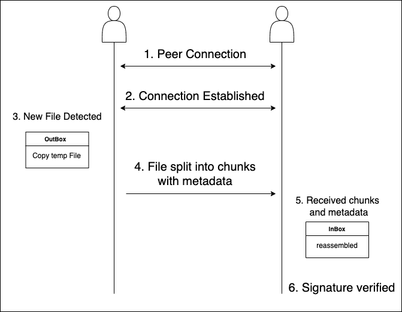

# mPeerSync
> mDNS와 서명 검증 기반의 로컬 네트워크 P2P 파일 동기화 도구

## 개요

**mPeerSync**는 같은 LAN 내의 장치 간에 파일을 동기화하기 위한 P2P 도구입니다.  
피어는 mDNS를 통해 자동으로 검색되며, `outbox/` 디렉토리에 파일이 추가되면 해당 파일은 조각으로 나뉘고 서명된 후 연결된 피어들에게 전송됩니다.  
피어는 수신한 조각을 `inbox/` 디렉토리에서 재조립하고 서명을 검증합니다.

---

## 동작 흐름



---

## 프로젝트 구조

```
mPeerSync/
├── crypto/      # 키 생성 및 로딩
├── file/        # 파일 감시 및 조각 처리
├── peer/        # 피어 탐색 및 연결 관리
├── util/        # 로그 유틸리티
├── main.go
```

---

## 사용 방법

```bash
# 바이너리 빌드
go build -o mpeersync

# 키 쌍 생성 (피어마다 1회 실행)
./mpeersync --keymake

# 포트를 지정하여 인스턴스 실행
./mpeersync --port 1234
```

각 피어는 `../sync/outbox/` 디렉토리를 감시
새로운 파일이 감지되면 자동으로 연결된 피어들에게 전송되고, 각 피어의 `../sync/inbox/` 디렉토리에 저장

---

## 보안

- 파일은 Ed25519 개인키로 서명
- 서명 검증은 수신 측의 `../keys/` 폴더에 있는 공개키를 기반으로 수행
- 서명 검증에 실패하더라도 파일은 삭제되지 않고 그대로 저장되며, 경고 로그가 출력

---

## 의존성

- https://github.com/libp2p/go-libp2p  
- https://github.com/fsnotify/fsnotify
