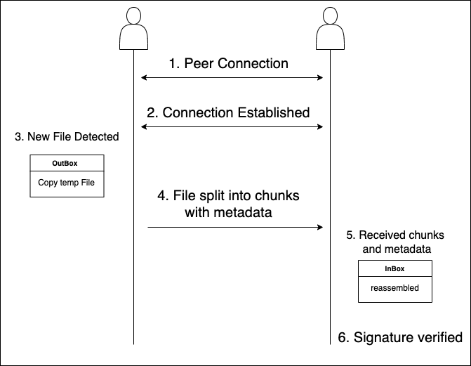

# mPeerSync
> Local network peer-to-peer file sync using mDNS and chunked transfer with signature verification.

> 🇰🇷 [한국어(Korean)](./README.ko.md)

## Overview

mPeerSync is a lightweight tool for syncing files between devices on the same LAN.  
Peers are discovered automatically using mDNS. When a file is added to the `outbox/` directory, it is split into chunks, signed, and sent to connected peers. Peers reassemble the file in their `inbox/` directory and verify its signature.

---

## Workflow



---

## Project Structure

```
mPeerSync/
├── crypto/      # Key handling
├── file/        # Chunking and watcher
├── peer/        # Discovery and connection
├── util/        # Logging helpers
├── main.go
```

---

## Usage

```bash
# Build binary
go build -o mpeersync

# Generate key pair (once per peer)
./mpeersync --keymake

# Run instance on a specific port
./mpeersync --port 1234
```

Each peer watches `../sync/outbox/`
New files are sent to discovered peers and saved in their `../sync/inbox/`

---

## Security

- Files are signed with Ed25519 private keys
- Signature verification uses public keys in the receiver’s `../keys/` folder
- If verification fails, the file is still saved and a warning is logged

---

## Dependencies

- https://github.com/libp2p/go-libp2p
- https://github.com/fsnotify/fsnotify